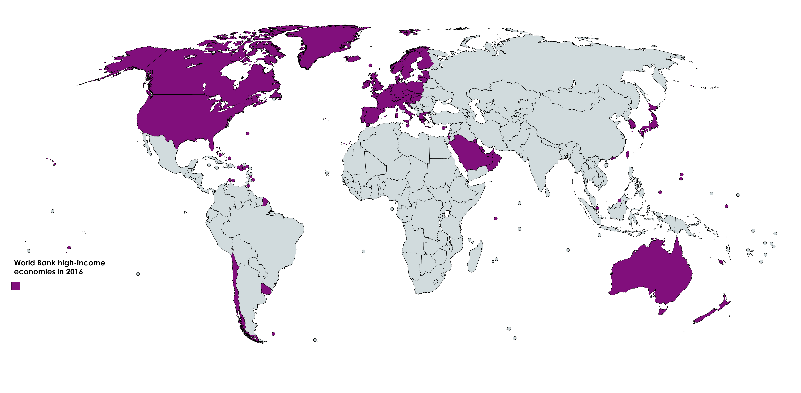

# Applied Data Science @ Columbia
## Fall 2018
## Project 1: What made you happy today?




### [Project Description](doc/Proj1_desc.md)
This is the first and only *individual* (as opposed to *team*) this semester. 

Term: Fall 2018

+ Projec title: What the source of happyness?
+ This project is conducted by Yimeng Qiu

+ Project summary: This Project applies text mining and NLP skills such as topic modeling and sentiment analysis on happy moments data. I separate data into two groups, High Income Economy countries and None High Income Economy countries, to see the level of country economy weather influence its citizens’ happyness.

Following [suggestions](http://nicercode.github.io/blog/2013-04-05-projects/) by [RICH FITZJOHN](http://nicercode.github.io/about/#Team) (@richfitz). This folder is orgarnized as follows.

```
proj/
├── lib/
├── data/
├── doc/
├── figs/
└── output/
```

Please see each subfolder for a README file.
